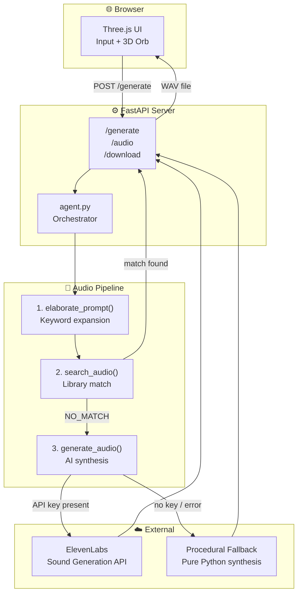
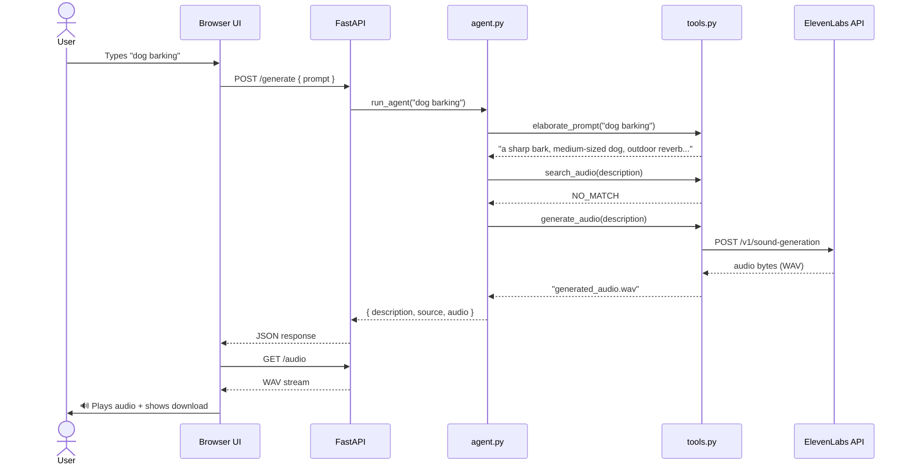
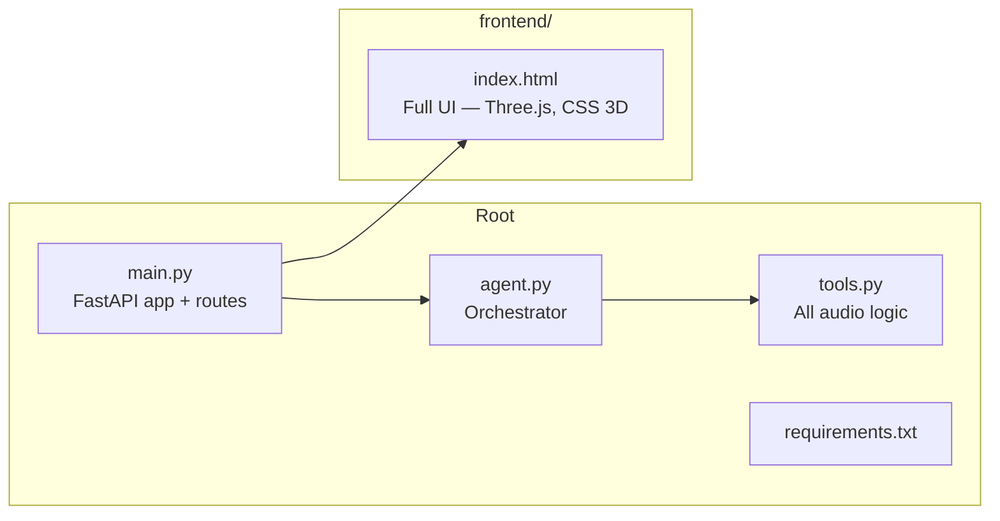

<div align="center">

# Audify.ai

**Type a word. Hear it.**

Describe any sound — thunder, a robot booting up, a wolf howling at 3am — and Audify synthesises it instantly using AI.

[](https://railway.app)
[](https://elevenlabs.io)
[](https://fastapi.tiangolo.com)

</div>

---

## What it does

You type any sound in plain English. Audify expands your input, searches a library, and if nothing matches — generates a brand-new audio clip using ElevenLabs AI. In seconds.

---

## Architecture



---

## Audio Generation Flow



---

## Stack

| Layer | Technology |
|---|---|
| Frontend | Vanilla JS, Three.js r128, CSS 3D |
| Backend | Python 3, FastAPI, Uvicorn |
| AI Sound Generation | ElevenLabs Sound Generation API |
| Fallback Synthesis | Pure Python (math, struct, random) |
| Deployment | Railway |

---

## How to run locally

```bash
# 1. Clone
git clone https://github.com/yshemashree/Audify.ai
cd Audify.ai

# 2. Install deps
pip install -r requirements.txt

# 3. Add your ElevenLabs key (optional — app works without it via fallback)
echo "ELEVENLABS_API_KEY=your_key_here" > .env

# 4. Start
uvicorn main:app --reload --port 8000
```

Open `http://localhost:8000`.

---

## Project structure



---

## Environment variables

| Variable | Required | Description |
|---|---|---|
| `ELEVENLABS_API_KEY` | No | Enables ElevenLabs AI generation. Without it, the procedural fallback runs. |

---

## Fallback sounds

When no API key is present, Audify generates audio procedurally in Python — no external calls, zero latency:

`rain` · `thunder` · `fire` · `wind` · `ocean` · `heartbeat` · `cat` · `dog` · `bird` · `keyboard` · `clock` · `footsteps` · `car` · `water` · `crowd` · `noise`

Anything else defaults to pink noise.

---

<div align="center">
  Built with ElevenLabs · FastAPI · Railway
</div>
