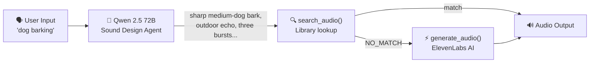
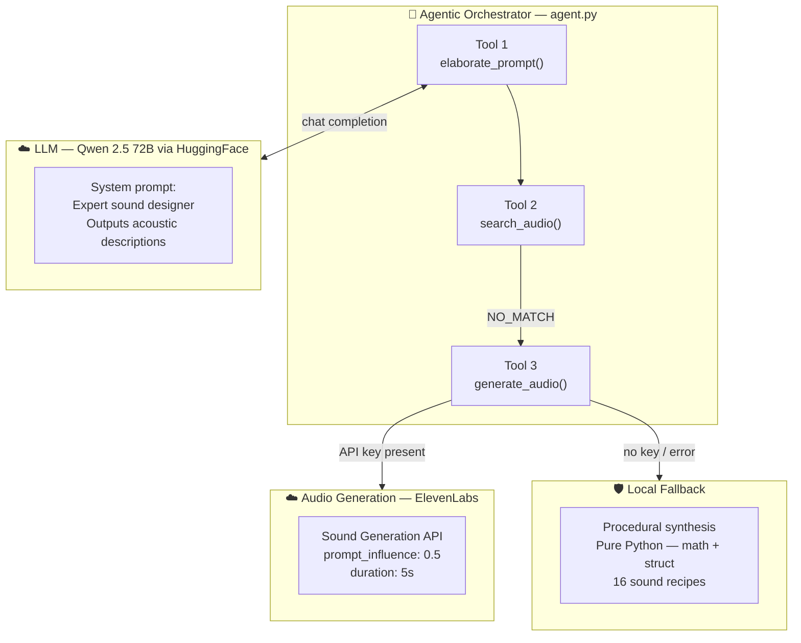
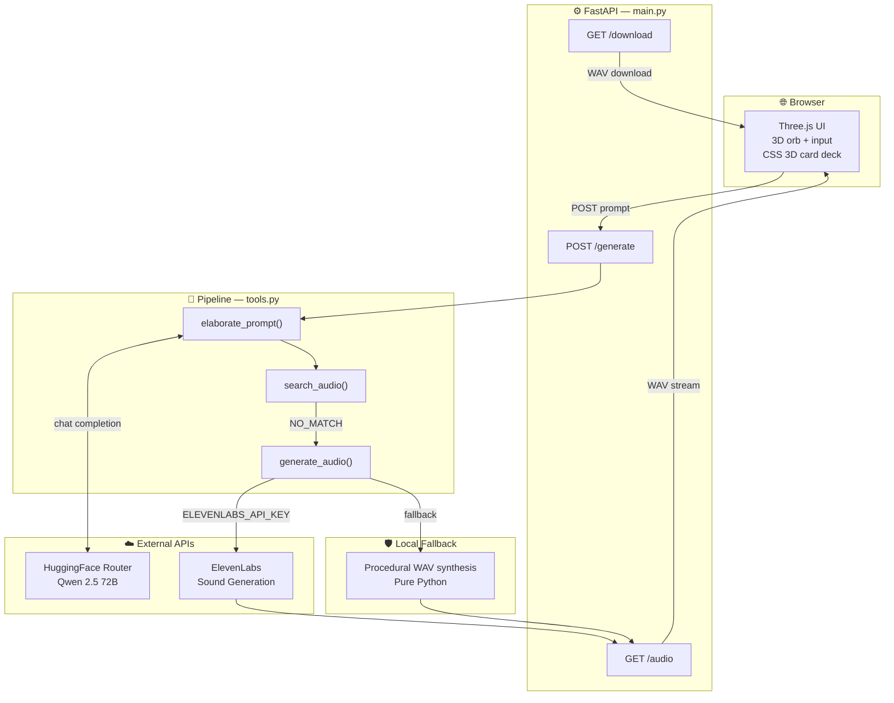
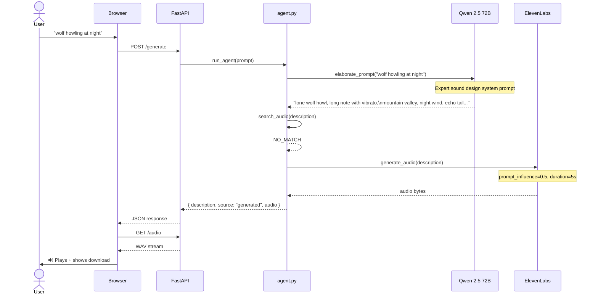

<div align="center">

# Audify.ai

**Type a word. Hear it.**

An agentic AI pipeline that takes any text description and synthesises it into audio — powered by a live LLM, ElevenLabs sound generation, and a Three.js frontend.

[](https://railway.app)
[](https://elevenlabs.io)
[](https://huggingface.co/Qwen/Qwen2.5-72B-Instruct)
[](https://fastapi.tiangolo.com)

</div>

---

## What makes it agentic

Most text-to-audio tools send your input directly to a generation model. Audify runs a **3-stage agentic pipeline** — an LLM reasons about your input first, then decides whether to retrieve or generate audio, then calls the appropriate tool.



The LLM doesn't just paraphrase your input — it acts as an expert sound designer, translating human descriptions into precise acoustic language (texture, pitch, reverb, distance, material) that ElevenLabs can synthesise accurately.

---

## Agentic pipeline — deep dive



### Stage 1 — elaborate_prompt()

The LLM receives a system prompt written as an expert sound designer. It outputs a precise acoustic description — never generic, always specific to what ElevenLabs needs to produce a great result.

> Input: `"wolf at night"`
> Output: `"lone wolf howl, long sustained note with vibrato, open mountain valley, night wind, distant echo tail, eerie silence before and after"`

### Stage 2 — search_audio()

The elaborated description is compared against a library of known clips using keyword similarity. A high-confidence match returns instantly without any generation.

### Stage 3 — generate_audio()

On `NO_MATCH`, the elaborated prompt is sent to ElevenLabs. If ElevenLabs is unavailable, a pure-Python procedural synthesiser generates audio locally with zero external calls.

---

## Full system architecture



---

## Request lifecycle



---

## Stack

| Layer | Technology |
|---|---|
| LLM Agent | Qwen 2.5 72B via HuggingFace Inference Router |
| Sound Generation | ElevenLabs Sound Generation API |
| Fallback Synthesis | Pure Python (math, struct, random) |
| Backend | FastAPI + Uvicorn |
| Frontend | Vanilla JS + Three.js r128 + CSS 3D |
| Deployment | Railway |

---

## Run locally

```bash
git clone https://github.com/yshemashree/Audify.ai
cd Audify.ai
pip install -r requirements.txt

# Add keys — both optional, app works without them via fallback
echo "ELEVENLABS_API_KEY=your_key" > .env
echo "HUGGINGFACE_API_TOKEN=your_token" >> .env

uvicorn main:app --reload --port 8000
```

Open `http://localhost:8000`.

---

## Environment variables

| Variable | Required | Effect |
|---|---|---|
| `ELEVENLABS_API_KEY` | No | Enables AI sound generation. Without it, procedural synthesis runs. |
| `HUGGINGFACE_API_TOKEN` | No | Enables LLM prompt expansion via Qwen 72B. Without it, keyword expansion runs. |

The app is fully functional with no API keys — just less accurate sound descriptions and procedural audio.

---

## Procedural fallback sounds

When no ElevenLabs key is present, Audify synthesises audio locally in pure Python:

`rain` · `thunder` · `fire` · `wind` · `ocean` · `heartbeat` · `cat` · `dog` · `bird` · `keyboard` · `clock` · `footsteps` · `car` · `water` · `crowd` · `noise`

---

<div align="center">
  Qwen 2.5 · ElevenLabs · FastAPI · Railway
</div>
