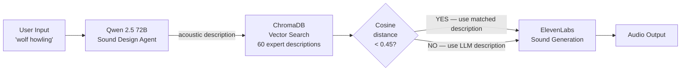
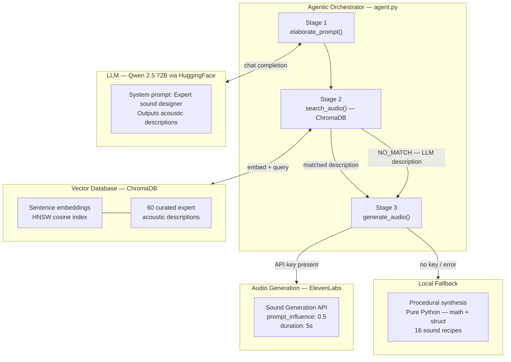
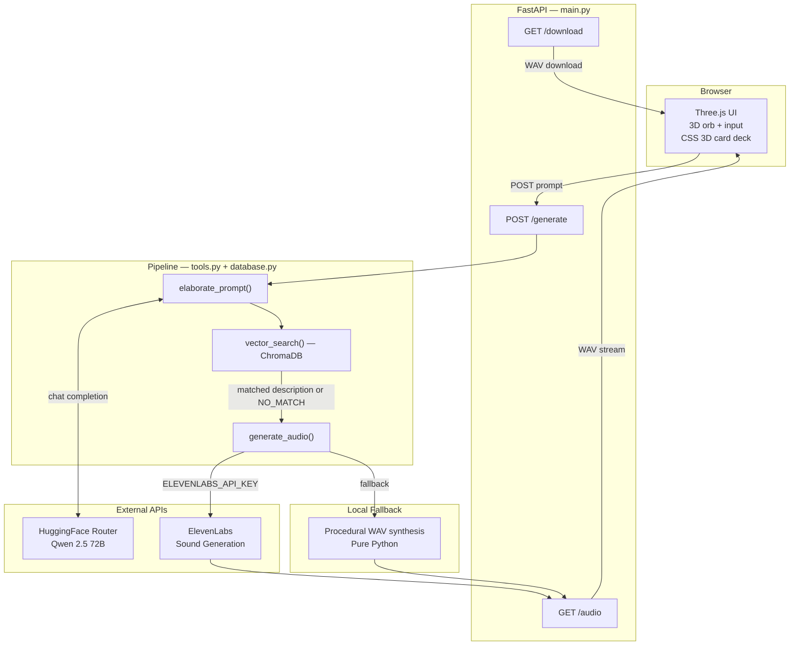
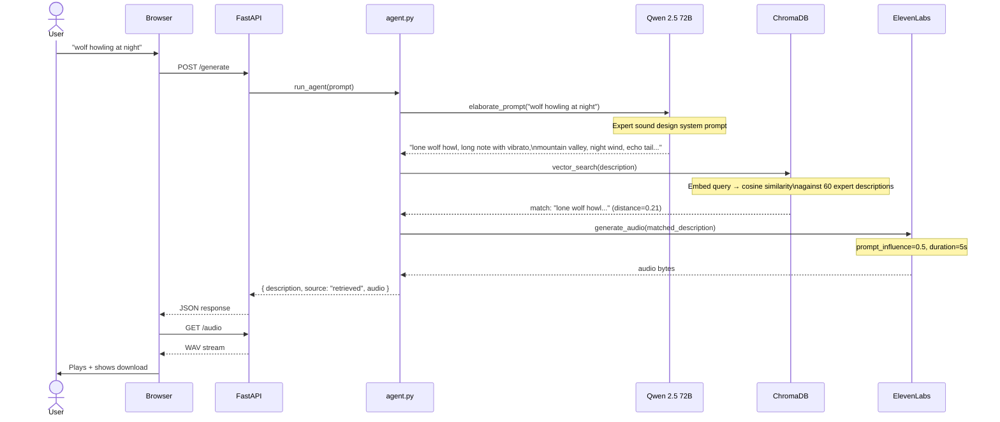

<div align="center">

# Audify.ai

**Type a word. Hear it play.**

An agentic AI pipeline that takes any text description and synthesises it into audio — powered by a live LLM, a ChromaDB vector database, ElevenLabs sound generation, and a Three.js frontend.

[](https://railway.app)
[](https://elevenlabs.io)
[](https://huggingface.co/Qwen/Qwen2.5-72B-Instruct)
[](https://www.trychroma.com)
[](https://fastapi.tiangolo.com)

</div>

---

## What makes it agentic

Most text-to-audio tools send your input directly to a generation model. Audify runs a **3-stage agentic pipeline** — an LLM reasons about your input first, then a ChromaDB vector search retrieves the best expert description, then the audio is generated from it.


```mermaid
flowchart LR
    INPUT["User Input\n'wolf howling'"]
    LLM["Qwen 2.5 72B\nSound Design Agent"]
    CHROMA["ChromaDB\nVector Search\n60 expert descriptions"]
    MATCH{Cosine\ndistance\n< 0.45?}
    GEN["ElevenLabs\nSound Generation"]
    OUT["Audio Output"]

    INPUT --> LLM
    LLM -->|acoustic description| CHROMA
    CHROMA --> MATCH
    MATCH -->|YES — use matched description| GEN
    MATCH -->|NO — use LLM description| GEN
    GEN --> OUT
```

The LLM acts as an expert sound designer, translating human descriptions into precise acoustic language. ChromaDB then checks if a curated expert description already exists for that sound — if so, that higher-quality description goes to ElevenLabs instead.

---

## Agentic pipeline — deep dive


```mermaid
graph TB
    subgraph Agent["Agentic Orchestrator — agent.py"]
        direction TB
        T1["Stage 1\nelaborate_prompt()"]
        T2["Stage 2\nsearch_audio() — ChromaDB"]
        T3["Stage 3\ngenerate_audio()"]
        T1 --> T2
        T2 -->|matched description| T3
        T2 -->|NO_MATCH — LLM description| T3
    end

    subgraph LLM["LLM — Qwen 2.5 72B via HuggingFace"]
        SP["System prompt: Expert sound designer\nOutputs acoustic descriptions"]
    end

    subgraph VectorDB["Vector Database — ChromaDB"]
        EMB["Sentence embeddings\nHNSW cosine index"]
        DS["60 curated expert\nacoustic descriptions"]
        EMB --- DS
    end

    subgraph Audio["Audio Generation — ElevenLabs"]
        EL["Sound Generation API\nprompt_influence: 0.5\nduration: 5s"]
    end

    subgraph Fallback["Local Fallback"]
        PROC["Procedural synthesis\nPure Python — math + struct\n16 sound recipes"]
    end

    T1 <-->|chat completion| LLM
    T2 <-->|embed + query| VectorDB
    T3 -->|API key present| Audio
    T3 -->|no key / error| Fallback
```

### Stage 1 — elaborate_prompt()

The LLM receives a system prompt written as an expert sound designer. It outputs a precise acoustic description — never generic, always specific to what ElevenLabs needs.

> Input: `"wolf at night"`
> Output: `"lone wolf howl, long sustained note with vibrato, open mountain valley, night wind, distant echo tail, eerie silence before and after"`

### Stage 2 — search_audio() with ChromaDB

The elaborated description is embedded into a vector and compared against 60 hand-curated expert acoustic descriptions stored in ChromaDB using cosine similarity.

- **Distance < 0.45** — semantically close match found. Return the curated expert description (higher quality than LLM output).
- **Distance ≥ 0.45** — no close match. Fall through with the LLM description.

This is a **RAG (Retrieval-Augmented Generation)** pattern: retrieve a better prompt before generating.

### Stage 3 — generate_audio()

The winning description (curated or LLM-generated) is sent to ElevenLabs. If ElevenLabs is unavailable, a pure-Python procedural synthesiser generates audio locally with zero external calls.

---

## ChromaDB vector database

`database.py` builds and queries the sound collection:

```python
# 60 expert descriptions are embedded and indexed on startup
collection.add(
    ids=[...],
    documents=["steady rainfall on leaves, soft patter rhythm, outdoor reverb", ...],
    metadatas=[{"label": "rain"}, ...]
)

# At query time — cosine similarity search
results = collection.query(query_texts=[elaborated_prompt], n_results=1)
distance = results["distances"][0][0]  # < 0.45 = match
```

ChromaDB uses an HNSW index with cosine distance. The dataset was curated with acoustic language (pitch, texture, reverb, distance, material) that matches how ElevenLabs expects prompts — generic descriptions give poor results, so the dataset is small but domain-specific.

---

## Full system architecture


```mermaid
graph TB
    subgraph Browser["Browser"]
        UI["Three.js UI\n3D orb + input\nCSS 3D card deck"]
    end

    subgraph Server["FastAPI — main.py"]
        R1["POST /generate"]
        R2["GET /audio"]
        R3["GET /download"]
    end

    subgraph Pipeline["Pipeline — tools.py + database.py"]
        EP["elaborate_prompt()"]
        VS["vector_search() — ChromaDB"]
        GA["generate_audio()"]
    end

    subgraph External["External APIs"]
        HF["HuggingFace Router\nQwen 2.5 72B"]
        EL["ElevenLabs\nSound Generation"]
    end

    subgraph Local["Local Fallback"]
        SYNTH["Procedural WAV synthesis\nPure Python"]
    end

    UI -->|POST prompt| R1
    R1 --> EP
    EP <-->|chat completion| HF
    EP --> VS
    VS -->|matched description or NO_MATCH| GA
    GA -->|ELEVENLABS_API_KEY| EL
    GA -->|fallback| SYNTH
    EL --> R2
    SYNTH --> R2
    R2 -->|WAV stream| UI
    R3 -->|WAV download| UI
```

---

## Request lifecycle


```mermaid
sequenceDiagram
    actor User
    participant UI as Browser
    participant API as FastAPI
    participant Agent as agent.py
    participant Qwen as Qwen 2.5 72B
    participant DB as ChromaDB
    participant EL as ElevenLabs

    User->>UI: "wolf howling at night"
    UI->>API: POST /generate
    API->>Agent: run_agent(prompt)

    Agent->>Qwen: elaborate_prompt("wolf howling at night")
    Note over Qwen: Expert sound design system prompt
    Qwen-->>Agent: "lone wolf howl, long note with vibrato,\nmountain valley, night wind, echo tail..."

    Agent->>DB: vector_search(description)
    Note over DB: Embed query → cosine similarity\nagainst 60 expert descriptions
    DB-->>Agent: match: "lone wolf howl..." (distance=0.21)

    Agent->>EL: generate_audio(matched_description)
    Note over EL: prompt_influence=0.5, duration=5s
    EL-->>Agent: audio bytes

    Agent-->>API: { description, source: "retrieved", audio }
    API-->>UI: JSON response
    UI->>API: GET /audio
    API-->>UI: WAV stream
    UI->>User: Plays + shows download
```

---

## Stack

| Layer | Technology |
|---|---|
| LLM Agent | Qwen 2.5 72B via HuggingFace Inference Router |
| Vector Database | ChromaDB with cosine similarity (HNSW index) |
| Sound Generation | ElevenLabs Sound Generation API |
| Fallback Synthesis | Pure Python (math, struct, random) |
| Backend | FastAPI + Uvicorn |
| Frontend | Vanilla JS + Three.js r128 + CSS 3D |
| Deployment | Railway |

---

## Run locally

```bash
git clone https://github.com/yshemashree/Audify.ai
cd Audify.ai
pip install -r requirements.txt

# Add keys — all optional, the app works without them via the offline synth
echo "FREESOUND_API_KEY=your_key" > .env
echo "ELEVENLABS_API_KEY=your_key" >> .env
echo "HUGGINGFACE_API_TOKEN=your_token" >> .env

uvicorn main:app --port 8000
```

Open `http://localhost:8000` — the backend serves the frontend. If you open
`frontend/index.html` directly or through a dev server (e.g. VS Code Live Server),
the page talks to `http://localhost:8000` automatically; point it elsewhere with
`?api=https://your-backend`. `GET /health` shows which engines have keys.

On Railway the `Procfile` starts the server on `$PORT`.

---

## Environment variables

| Variable | Required | Effect |
|---|---|---|
| `FREESOUND_API_KEY` | No | Real recorded sound effects from Freesound. |
| `ELEVENLABS_API_KEY` | No | AI sound generation with ElevenLabs. |
| `HUGGINGFACE_API_TOKEN` | No | LLM prompt expansion via Qwen 72B for sounds not in the built-in library. |

Freesound and ElevenLabs are called in parallel and **layered into one track**:
the real recording is the body, the ElevenLabs take sits on top (`mixer.py`).
If only one of them answers it is used alone; if neither does, the offline synth
takes over, so a request always returns playable audio.

Every result then goes through a **cinematic exaggeration chain**: +7 dB low-end,
presence boost, parallel compression, saturation, stereo widening and a limiter.
Typical result: 8–10 dB louder with far bigger, punchier impact.

---

## Built-in real recordings (offline)

`sounds/` ships real recordings for 37 categories, including 7 hand-scored glass shatters, dogs, cats, farm animals, rain, sea, fire, thunder, wind, water, birds, keyboard and traffic. They come from the ESC-50 dataset (originally Freesound). `library.py` builds sounds from them with no network or API keys:

- **glass shattering**: real shatters played as separate hits, each layered with the ElevenLabs take when available
- **glass cracking**: spidering cracks assembled from micro-fragments cut out of the real shatters; **glass cracks and shatters** escalates into a real break
- **animals**: real calls sequenced with natural pauses; Freesound takes are mixed in when online
- **scenes**: recorded beds chained with crossfades, with real events (horns, drips, birds) sprinkled over them

Priority: built-in recordings, then Freesound/ElevenLabs, then the synth. Subjects the library has no recordings of (wolf, lion, horse, elephant, sci-fi) fall through to the online sources or the synth.

**Offline sample chips**: `frontend/samples/` holds a pre-rendered MP3 for every sample chip. If the server can't be reached (no internet, server down, or `index.html` opened from disk), clicking a chip still plays its sound.

Rebuild after changing things:

```bash
python scripts/build_sound_library.py    # re-download and re-score ESC-50 takes
python scripts/build_offline_samples.py  # re-render the chip samples
```

> **License:** ESC-50 is CC BY-NC 3.0 (non-commercial; the ESC-10 subset is CC BY). See `sounds/CREDITS.md` for per-clip attribution. Before commercial use, replace `sounds/` with recordings you have commercial rights to (for example CC0 sounds from Freesound).

## Procedural fallback sounds

When no API is available, Audify synthesises audio locally with numpy.

**Glass (VFX grade, `synth.py`)**: `glass shattering` (crack transient, impact thump, shard burst, flying fragments, bouncing debris, tinkle tail, in stereo), `glass cracking` / `ice cracking` (spidering micro-fractures and creaks), `glass cracks and shatters` (escalating cracks ending in a break).

**Animals (`animals.py`)**: a source-filter voice engine (pitch contour, moving formants, breath and growl roughness) with calls for `cat` · `kitten` · `dog` · `puppy` · `growl` · `wolf` · `lion` · `tiger` · `bear` · `cow` · `horse` · `sheep` · `goat` · `pig` · `duck` · `rooster` · `chicken` · `owl` · `crow` · `eagle` · `elephant` · `monkey` · `frog` · `donkey` · `crickets` · `bees` · `snake` · `rattlesnake`.

**Scenes**: `thunderstorm` · `rain` · `rain on glass` · `ocean` · `campfire` · `wind` · `waterfall` · `water` · `bird` · `heartbeat` · `keyboard` · `clock` · `footsteps` · `city traffic` · `crowd` · `coffee shop` · `spaceship` · `laser` · `portal` · `robot power-up`

## How each kind of sound is built

| Kind | Examples | Freesound | Combined as | Mastering |
|---|---|---|---|---|
| Impact | glass, smash, crack | 3 takes, 0.4–10 s | each real take layered with the ElevenLabs take, attacks aligned to the sample, then laid out as separate hits | razor transients, sub boom under each hit, +6 dB air, wide stereo, room tail |
| Vocal | animals | 3 takes, 0.5–20 s | real and AI calls alternated with natural pauses | chesty low end, forward presence, grit, small room |
| Ambience | rain, fire, city | 1 take, 6–90 s | recording and AI take layered into one bed | heavy low end, squashed and saturated, wide |

---

<div align="center">
  Qwen 2.5 · ChromaDB · ElevenLabs · FastAPI · Railway
</div>
